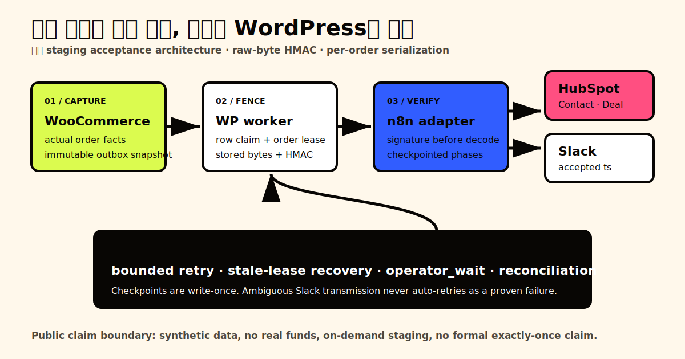

# PF07 — OddRoom Woo OrderOps

## 구매자가 겪는 문제

WooCommerce 주문을 사람이 CRM에 옮기면 누락과 중복 효과가 생기기 쉽고, 외부 API가 중간에 실패했을 때 무엇이 이미 반영됐는지 확인하기 어렵습니다. OddRoom Woo OrderOps는 네 가지 주문 사실을 불변 outbox에 한 번 기록하고, 주문별 직렬화·제한 재시도·운영자 확인 경로를 통해 HubSpot과 Slack 전달 상태를 설명 가능하게 만듭니다.

## 공개 영상

- [70초 end-to-end walkthrough](https://cetacean916.github.io/portfolio-showcase/assets/media/pf07/demo-video.mp4) — 계약의 60–90초 범위 안에서 정상 경로와 복구 경로를 함께 보여줍니다.
- [실패 → 재시도 → 복구 짧은 클립](https://cetacean916.github.io/portfolio-showcase/assets/media/pf07/recovery-clip.mp4)

두 영상은 합성 주문과 마스킹된 별칭만 사용하며, 보호 계정·호스트·webhook·토큰·개인 식별자는 포함하지 않습니다.

## 전달 구조와 운영 결과

1. WooCommerce hook이 실제 주문 사실에서 정규화된 UTF-8 snapshot과 결정적 event key를 만듭니다.
2. Action Scheduler가 outbox 행을 실행하고, 행 claim과 주문별 InnoDB lease가 같은 주문의 외부 효과를 직렬화합니다.
3. WordPress가 저장된 원문 바이트를 timestamped HMAC으로 서명합니다.
4. n8n이 서명과 resource bounds를 먼저 검증하고 HubSpot Contact·Deal·association을 확인한 뒤 필요한 이벤트만 Slack에 알립니다.
5. WordPress가 반환된 checkpoint를 fencing token 아래 write-once로 저장합니다. 결과가 모호하면 자동 재시도 대신 `operator_wait`로 이동합니다.

공개 showcase의 상세 화면에는 마스킹된 WordPress 이벤트 표와 같은 event alias로 연결된 HubSpot Deal 상태가 함께 표시됩니다.

## Proof scorecard

| 관찰 항목 | 실제 관찰 수치 | 연결 근거 |
| --- | ---: | --- |
| 지원 주문 이벤트 | 4종 | `GATE-02` |
| 서로 다른 변수 입력 주문 | 3건 | `GATE-03` |
| 동시 중복 억제 | worker 3개 + 보호 Manual Retry 1회, Deal 1개, Slack 1회 | `GATE-04` |
| 자동 시도 상한 | 6회, 지연 `2/5/10/20/30`초 | `GATE-06` |
| 부분 실패 복구 | CRM checkpoint 유지, 재개 후 Slack 총 1회 | `GATE-07` |
| reconciliation repair | 누락 이벤트 4건 + schedule-only 1건, 두 번째 scan 0변경 | `GATE-08` |
| clean restore | 새 환경 1개, 새 주문 1건, Deal 1개, payment Slack 1회, duplicate 추가 0회 | `GATE-10` |

[공개 acceptance index](../evidence/public/acceptance-matrix.json)는 `GATE-01`부터 `GATE-10`까지 정확히 한 항목씩 연결합니다. 각 public record는 보호 raw record와 redaction transform을 SHA-256으로 결속하지만 보호 식별자나 raw 경로를 공개하지 않습니다.

## 소스와 검증 링크

- [공개 소스 저장소](https://github.com/Cetacean916/oddroom-woo-orderops)
- [WordPress plugin tests](../plugin/oddroom-orderops/tests/run.php)
- [public-safe CI](../scripts/ci)
- [credential-free n8n workflow](../workflow/oddroom-orderops-vsl.json)
- [공개 evidence index](../evidence/public/acceptance-matrix.json)
- [복구 runbook](../docs/RECOVERY-RUNBOOK.md)

## What this proves

- WooCommerce custom plugin with durable event tracking.
- Tested duplicate suppression and bounded retries.
- Signed n8n adapter to HubSpot and Slack.
- Fault-injection and reconciliation evidence.
- Staging backup/restore drill completed.

## What this does not prove

- Production load, scale, uptime, or SLA.
- Real payment, customer, revenue, refund, tax, or settlement processing.
- Partial refund, chargeback, reopened/reversed terminal orders, or every WooCommerce edge case.
- Reconstruction of a cancellation timestamp when PF07 never observed and persisted the first transition fact.
- Formal exactly-once delivery.
- Resistance to replay of a captured, still-valid signed request.
- Elimination of the Slack accepted/response-lost window.
- Protection against unrelated external writers to the same HubSpot Deal.

## Hosting and disclosure

`ON_DEMAND_ONLY` — 합성 staging runtime은 검증 창에서만 HTTPS로 실행합니다. 정적 public case와 redacted evidence는 runtime uptime과 무관하게 계속 제공됩니다. 모든 주문·고객·결제 정보는 합성이며 실제 금액을 수집하지 않았습니다.

## Buyer fit / non-fit

WooCommerce 주문을 CRM과 알림으로 연결하면서 불변 snapshot, 제한 재시도, 운영자 확인, 복구 근거가 필요한 맞춤형 업무에는 적합합니다. 고규모 운영 증명, 실결제, 모든 WooCommerce edge case, formal exactly-once delivery, 즉시 사용 가능한 multi-tenant SaaS를 찾는 경우에는 적합하지 않습니다.
